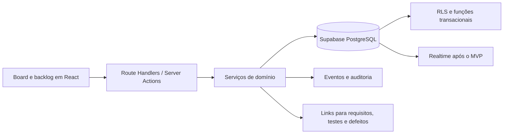
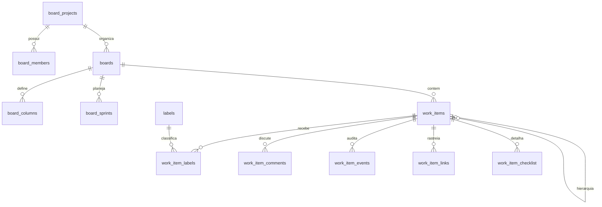

# Planejamento de implementação — Board de trabalho

Status: proposta para implementação  
Última revisão: 23 de agosto de 2026  
Escopo: QA Lab Playground, frontend Next.js e persistência Supabase/PostgreSQL

## 1. Objetivo

Evoluir o protótipo existente em `/lab/historias` para um board de trabalho completo, inspirado nos padrões consolidados de Jira e Azure Boards, mas integrado ao contexto do QA Lab.

O produto deve permitir que uma pessoa ou equipe planeje, priorize, execute e acompanhe histórias, tarefas, bugs e atividades de teste dentro de um projeto. O board deve ser útil tanto para estudo individual quanto para trabalho colaborativo real.

O objetivo não é copiar todas as funções do Jira ou Azure DevOps. A implementação deve entregar primeiro um núcleo confiável e simples, com espaço de evolução para sprints, métricas, automações e integrações.

## 2. Diagnóstico do estado atual

### O que já existe

- Frontend em Next.js 16, React 19, TypeScript e Tailwind.
- Autenticação, sessão e banco por Supabase.
- Route Handlers e Server Actions usados para operações autenticadas.
- RLS aplicada às tabelas atuais por `user_id`.
- Entidade `projects` e módulos de Test Design Studio e Execution & Defect Hub.
- Protótipo visual em `packages/web/app/lab/historias`.
- Tabelas `story_states` e `user_stories` para estado individual.
- Playwright para testes de interface e `bun test` para regras de domínio.

### Limitações do protótipo

- Board individual, sem equipe, membros ou papéis.
- Colunas e workflow fixos no código.
- Alteração de status apenas por avanço sequencial; não há drag-and-drop.
- Backlog representado como status, misturando planejamento com workflow.
- Sem edição completa, exclusão, comentários, histórico ou anexos.
- Sem sprint persistida, metas, datas ou planejamento de capacidade.
- Sem ordenação persistente dentro das colunas.
- Filtros visuais sem implementação real.
- Identificadores como `EXP-101` gerados no cliente e sujeitos a colisão.
- Atualização otimista sem tratamento adequado de erro ou concorrência.
- Conteúdo seed misturado com artefatos reais do usuário.
- Persistência direta via Server Actions, sem uma camada de domínio reutilizável.

### Decisão arquitetural principal

O board fará parte do backend de produto do Next.js e usará Supabase/PostgreSQL como fonte de verdade. A API Hono executada na porta `3003` é uma API de laboratório com armazenamento em memória e não deve guardar dados do board.

## 3. Referências funcionais

O benchmark confirmou padrões que fazem sentido para o produto:

- Jira usa swimlanes para separar horizontalmente itens por épico, responsável ou outra categoria e oferece filtros rápidos para recortes como “meus itens” e “atualizados recentemente”.
- Azure Boards representa etapas do fluxo em colunas, atualiza o trabalho ao arrastar cartões e diferencia boards contínuos de taskboards ligados a sprint; também usa métricas de fluxo.
- Os dois produtos tratam backlog, workflow, filtros e visualização como conceitos separados.

Referências oficiais:

- [Jira — configuração de swimlanes](https://support.atlassian.com/jira-software-cloud/docs/configure-swimlanes/)
- [Jira — configuração de filtros rápidos](https://support.atlassian.com/jira-software-cloud/docs/configure-quick-filters/)
- [Azure Boards — visão geral de Kanban](https://learn.microsoft.com/en-us/azure/devops/boards/boards/kanban-overview?view=azure-devops)

## 4. Princípios de produto

1. Backlog não é status. Um item pode estar no backlog e possuir o primeiro status do workflow.
2. Toda movimentação deve ser persistida, auditável e reversível em caso de falha.
3. A UI deve continuar utilizável por teclado, não apenas por mouse.
4. O board deve funcionar primeiro para uma pessoa e crescer naturalmente para uma equipe.
5. O modelo deve reconhecer o domínio de QA: bug, teste, severidade, evidência e rastreabilidade.
6. Configuração avançada não deve poluir o fluxo básico.
7. Permissão deve ser garantida no banco por RLS e validada novamente no servidor.
8. Métricas devem derivar de eventos reais, não do estado atual apenas.

## 5. Escopo funcional

### 5.1 MVP — obrigatório para lançamento

#### Projetos e acesso

- Listar boards acessíveis ao usuário.
- Criar board dentro de um projeto.
- Criar projeto de board quando nenhum projeto existir.
- Convidar membros por e-mail.
- Papéis: proprietário, administrador, membro e visualizador.
- Arquivar board sem apagar os dados.

#### Workflow

- Criar, renomear, ordenar e desativar colunas.
- Workflow inicial: A fazer, Em andamento, Em revisão e Concluído.
- Cor e limite de WIP opcionais por coluna.
- Impedir remoção de coluna que ainda possui itens, salvo com remapeamento explícito.
- Definir coluna inicial e coluna final.

#### Itens de trabalho

- Tipos: épico, história, tarefa, bug e teste.
- Campos básicos: chave, título, descrição, tipo, status, prioridade, responsável, repórter, etiquetas, pontos, datas e posição.
- Campos de bug: severidade, ambiente, passos, resultado esperado e resultado atual.
- Critérios de aceite e checklist.
- Criar, abrir, editar, duplicar, arquivar e restaurar item.
- Chave gerada no servidor no formato `SIGLA-123`.
- Vínculo pai-filho: épico para história e item para subtarefa.
- Link opcional para requisito, caso de teste, execução ou defeito já existente no QA Lab.

#### Board e backlog

- Drag-and-drop entre colunas e dentro da mesma coluna.
- Atualização otimista com rollback e mensagem em caso de falha.
- Backlog separado do board.
- Ordenação manual no backlog.
- Planejar item do backlog para o board ativo.
- Busca por chave e texto.
- Filtros por tipo, responsável, prioridade, etiqueta e “somente meus itens”.
- Estado de filtro refletido na URL para permitir compartilhamento e retorno pelo navegador.
- Contagem de itens e pontos por coluna.
- Indicador visual quando o limite de WIP for excedido.

#### Detalhes e colaboração

- Drawer lateral para visualizar e editar item sem sair do board.
- Comentários em ordem cronológica.
- Histórico de criação, edição, atribuição e movimentação.
- Menções simples a membros nos comentários.
- Avatar, data e autor em cada atividade.

#### Qualidade e segurança

- Interface responsiva; em telas pequenas, board com rolagem horizontal e alternativa em lista.
- Operações de teclado equivalentes ao drag-and-drop.
- Estados de loading, vazio, erro, offline e permissão negada.
- RLS por associação ao board.
- Proteção contra alteração de `board_id`, responsável ou coluna de outro board.
- Auditoria de operações sensíveis.

### 5.2 Versão 1.1 — planejamento ágil

- Criar, iniciar, concluir e cancelar sprint.
- Uma sprint ativa por board Scrum.
- Objetivo, datas e capacidade planejada da sprint.
- Planejamento de sprint com seleção em lote.
- Relatório de sprint e burndown.
- Itens não concluídos voltam ao backlog ou seguem para outra sprint.
- Swimlanes por épico, responsável, prioridade ou tipo.
- Filtros salvos pessoais e filtros compartilhados.
- Seleção em lote e edição em massa.
- Importação e exportação CSV.

### 5.3 Versão 1.2 — colaboração em tempo real e métricas

- Atualização em tempo real por Supabase Realtime.
- Presença de usuários no board.
- Notificações internas de menção, atribuição e vencimento.
- Cycle time, lead time, throughput e cumulative flow diagram.
- Dashboard por projeto e por sprint.
- Políticas explícitas por coluna, como definição de pronto.
- Anexos privados por item com URLs assinadas.

### 5.4 Futuro — não incluir no MVP

- Motor de automação “quando/então”.
- Workflow com transições condicionais e aprovações.
- Campos personalizados configuráveis.
- Dependências e timeline estilo roadmap.
- Integrações GitHub/GitLab e vínculo com pull request.
- Webhooks e API pública.
- Templates de projeto.
- IA para decompor histórias, sugerir critérios e gerar casos de teste.
- Sincronização bidirecional com Jira ou Azure DevOps.

## 6. Fora de escopo inicial

- Clonar JQL ou WIQL.
- Replicar o modelo completo de permissões do Jira.
- Suportar múltiplos workflows no mesmo board no MVP.
- Criar automações complexas antes de o histórico de eventos estar estável.
- Permitir customização irrestrita de campos no primeiro lançamento.
- Usar a API Hono em memória como fonte de verdade.

## 7. Arquitetura proposta

### Frontend

- Server Component carrega board, colunas, membros e primeiro lote de itens.
- Client Component mantém interação, drag-and-drop, filtros e drawer.
- TanStack Query não é obrigatório no MVP; pode-se manter estado local controlado e revalidar após mutações.
- Adotar `@dnd-kit/core`, `@dnd-kit/sortable` e suporte de teclado do próprio pacote.
- Usar virtualização somente se a telemetria indicar colunas com centenas de cartões.
- Preservar os componentes existentes de botão, sheet, popover, select, tooltip, badge e sonner.

### Backend de produto

- Criar serviços em `packages/web/lib/board/` com regras puras separadas de Supabase.
- Expor operações em `/api/v1/boards` para mutações e consultas usadas pelo cliente.
- Server Actions podem ser mantidas para formulários simples, mas movimentação, lote, filtros paginados e integrações devem usar Route Handlers com contrato JSON consistente.
- Validar payloads no servidor. Adicionar Zod como dependência direta do web ou ampliar o validador já existente.
- Nunca confiar em `user_id`, `reporter_id`, `board_id` ou posição enviados pelo cliente sem verificar associação.

### Persistência

- PostgreSQL/Supabase como fonte de verdade.
- RLS baseada em associação ao projeto/board, não apenas em `user_id`.
- Função SQL transacional para movimentação e reordenação.
- Eventos append-only para histórico e métricas.
- Exclusão lógica para boards e itens; exclusão física apenas em rotina administrativa.

## 8. Modelo de dados

### Relações principais

### Tabelas

#### `board_projects`

- `id uuid pk`
- `owner_id uuid fk auth.users`
- `name text`
- `key text unique` — 2 a 10 caracteres, maiúsculos
- `description text`
- `linked_project_id uuid null` — referência opcional ao `projects` existente
- `status active|archived`
- `next_issue_number bigint`
- `created_at`, `updated_at`, `archived_at`

Motivo para tabela própria: o `projects` atual é estritamente individual e suas políticas protegem várias entidades por `user_id`. Alterá-lo diretamente para colaboração aumentaria o risco de vazamento em módulos já existentes. A ligação opcional permite integração gradual.

#### `board_members`

- `project_id uuid`
- `user_id uuid null`
- `invited_email citext null`
- `role owner|admin|member|viewer`
- `status invited|active|revoked`
- `invited_by`, `invited_at`, `joined_at`
- chave única por projeto e usuário/e-mail

#### `boards`

- `id uuid pk`
- `project_id uuid`
- `name text`
- `kind kanban|scrum`
- `description text`
- `active_sprint_id uuid null`
- `status active|archived`
- `settings jsonb` somente para preferências não relacionais
- `created_by`, `created_at`, `updated_at`

#### `board_columns`

- `id uuid pk`
- `board_id uuid`
- `name text`
- `position integer`
- `category todo|in_progress|done`
- `color text`
- `wip_limit integer null`
- `is_initial boolean`
- `is_final boolean`
- `active boolean`
- índice único `(board_id, position)` e regra de uma coluna inicial/final ativa

#### `board_sprints`

- `id uuid pk`
- `board_id uuid`
- `name text`
- `goal text`
- `status planned|active|completed|canceled`
- `starts_at`, `ends_at`, `completed_at`
- `created_by`, `created_at`, `updated_at`
- índice parcial garantindo no máximo uma sprint ativa por board

#### `work_items`

- `id uuid pk`
- `project_id uuid`
- `board_id uuid`
- `column_id uuid`
- `sprint_id uuid null` — `null` significa backlog no board Scrum
- `parent_id uuid null`
- `issue_number bigint`
- `key text` derivada da chave do projeto e número
- `type epic|story|task|bug|test|subtask`
- `title text`
- `description text`
- `priority lowest|low|medium|high|highest`
- `severity null|low|medium|high|critical`
- `story_points numeric null`
- `reporter_id uuid`
- `assignee_id uuid null`
- `due_at timestamptz null`
- `rank bigint`
- `version integer` para concorrência otimista
- `acceptance_criteria jsonb`
- `qa_details jsonb` no MVP, com esquema validado por tipo
- `created_at`, `updated_at`, `resolved_at`, `archived_at`
- únicos `(project_id, issue_number)` e `(project_id, key)`

Se os campos de QA passarem a ser muito consultados em filtros ou métricas, devem migrar de `qa_details` para colunas tipadas.

#### Entidades auxiliares

- `labels`: nome e cor únicos por projeto.
- `work_item_labels`: relação N:N.
- `work_item_checklist`: texto, posição, concluído, autor e data.
- `work_item_comments`: corpo, autor, timestamps e `deleted_at`.
- `work_item_events`: evento append-only com tipo, ator, antes/depois em JSON e data.
- `work_item_links`: relação com item, requisito, caso, execução ou defeito.
- `work_item_attachments`: caminho no Storage privado, nome, tipo, tamanho e autor; fica para 1.2.
- `saved_filters`: proprietário, escopo pessoal/compartilhado e definição JSON; fica para 1.1.
- `notifications`: destinatário, tipo, payload, lida em; fica para 1.2.

## 9. Ordenação e movimentação

### Estratégia de rank

- Cada coluna usa ranks inteiros com intervalos de 1024.
- Inserção entre dois cartões usa o ponto médio.
- Quando não houver intervalo, uma função SQL renumera apenas a coluna afetada.
- Backlog usa a mesma estratégia em um escopo separado.
- O cliente nunca calcula a posição final sozinho; ele envia `before_id` e `after_id`.

### Operação transacional `move_work_item`

Entrada:

- item
- board e coluna de destino
- sprint de destino ou backlog
- item anterior e próximo
- versão esperada do item

Regras:

1. Confirmar que o ator é membro com permissão de edição.
2. Confirmar que item, coluna, sprint e vizinhos pertencem ao mesmo board.
3. Bloquear logicamente o escopo de ordenação durante o cálculo.
4. Validar limite de WIP; no MVP, alertar e permitir, salvo configuração futura de bloqueio.
5. Calcular rank, atualizar coluna/sprint, incrementar `version`.
6. Inserir evento com origem e destino.
7. Retornar item canônico e totais afetados.
8. Em conflito de versão, responder `409` e solicitar refresh do escopo.

## 10. Contrato da API

Padrão de sucesso: `{ "data": ... }`.  
Padrão de erro: `{ "error": { "code": "...", "message": "...", "details": {} } }`.

### Boards e configuração

- `GET /api/v1/board-projects`
- `POST /api/v1/board-projects`
- `GET /api/v1/board-projects/:projectId`
- `PATCH /api/v1/board-projects/:projectId`
- `GET /api/v1/boards/:boardId`
- `POST /api/v1/board-projects/:projectId/boards`
- `PATCH /api/v1/boards/:boardId`
- `PUT /api/v1/boards/:boardId/columns`

### Itens

- `GET /api/v1/boards/:boardId/items?view=board|backlog&...filtros`
- `POST /api/v1/boards/:boardId/items`
- `GET /api/v1/work-items/:itemId`
- `PATCH /api/v1/work-items/:itemId`
- `DELETE /api/v1/work-items/:itemId` — arquivamento lógico
- `POST /api/v1/work-items/:itemId/move`
- `POST /api/v1/work-items/:itemId/restore`
- `POST /api/v1/work-items/bulk`

### Colaboração

- `GET /api/v1/board-projects/:projectId/members`
- `POST /api/v1/board-projects/:projectId/invitations`
- `PATCH /api/v1/board-projects/:projectId/members/:memberId`
- `DELETE /api/v1/board-projects/:projectId/members/:memberId`
- `GET /api/v1/work-items/:itemId/comments`
- `POST /api/v1/work-items/:itemId/comments`
- `PATCH /api/v1/comments/:commentId`
- `DELETE /api/v1/comments/:commentId`
- `GET /api/v1/work-items/:itemId/events`

### Sprint — 1.1

- `GET /api/v1/boards/:boardId/sprints`
- `POST /api/v1/boards/:boardId/sprints`
- `POST /api/v1/sprints/:sprintId/start`
- `POST /api/v1/sprints/:sprintId/complete`
- `POST /api/v1/sprints/:sprintId/cancel`

### Códigos HTTP relevantes

- `200/201/204`: sucesso.
- `400`: payload estruturalmente inválido.
- `401`: sem sessão.
- `403`: membro sem permissão.
- `404`: entidade inexistente ou invisível por RLS.
- `409`: conflito de versão, sprint já ativa, chave duplicada ou ordenação concorrente.
- `422`: regra de negócio ou campos inválidos.
- `429`: limite de criação/operação quando aplicável.

## 11. Permissões

| Ação | Owner | Admin | Member | Viewer |
|---|---:|---:|---:|---:|
| Ver board e itens | Sim | Sim | Sim | Sim |
| Criar/editar/mover item | Sim | Sim | Sim | Não |
| Comentar | Sim | Sim | Sim | Opcional |
| Configurar colunas | Sim | Sim | Não | Não |
| Gerenciar sprint | Sim | Sim | Sim | Não |
| Convidar/remover membro | Sim | Sim | Não | Não |
| Alterar papel de admin | Sim | Não | Não | Não |
| Arquivar projeto/board | Sim | Sim | Não | Não |
| Transferir propriedade | Sim | Não | Não | Não |

### RLS

- Criar helpers `is_board_project_member`, `can_edit_board_project` e `can_admin_board_project` como funções `security definer` com `search_path` fixo.
- Revogar execução pública e conceder apenas a `authenticated` quando necessário.
- Policies de leitura usam associação ativa.
- Policies de escrita exigem papel adequado.
- Eventos podem ser inseridos somente por função transacional ou backend confiável.
- Convites por e-mail não devem expor existência de contas.
- Storage deve usar caminhos prefixados por projeto e item e validar acesso por associação.

## 12. Experiência do usuário

### Rotas propostas

- `/boards` — lista de projetos e boards.
- `/boards/new` — criação inicial.
- `/boards/:boardId` — board.
- `/boards/:boardId/backlog` — backlog e planejamento.
- `/boards/:boardId/settings` — colunas, membros e preferências.
- `/boards/:boardId/reports` — versão 1.1/1.2.
- `/boards/:boardId/items/:key` — deep link do item, abrindo o drawer.

### Estrutura do board

- Cabeçalho: projeto, board, sprint, busca e ações.
- Barra de filtros: meus itens, tipo, responsável, prioridade e etiquetas.
- Área rolável com colunas.
- Cartão compacto: tipo, chave, título, etiquetas, responsável, prioridade, pontos e vencimento.
- Drawer: edição completa, checklist, links de QA, comentários e atividade.
- Rodapé/indicadores: itens visíveis, filtros ativos e estado de sincronização.

### Estados essenciais

- Primeiro uso com CTA para criar o primeiro item.
- Coluna vazia como alvo de drop claro.
- Filtro sem resultado com ação para limpar filtros.
- Salvando, salvo, falha e conflito de versão.
- Board somente leitura.
- Limite de WIP excedido.
- Usuário removido durante uma sessão.
- Item movido por outra pessoa — versão 1.2.

### Acessibilidade

- Colunas como regiões nomeadas e cartões como itens navegáveis.
- Botão “Mover para…” em cada cartão, além do drag.
- Sensor de teclado e anúncio `aria-live` para origem/destino.
- Ordem de foco preservada após movimento.
- Drawer com foco preso, retorno de foco e Escape.
- Não depender apenas de cor para status, prioridade ou limite.
- Alvos mínimos de toque e rolagem horizontal operável.

## 13. Integração com os módulos de QA

### MVP

- Tipo `bug` traz campos de severidade e detalhes de reprodução.
- Tipo `test` pode apontar para um `test_case` existente.
- A ação “Desenhar testes” leva ao Test Design Studio com contexto do item.
- Um defeito do Execution Hub pode ser vinculado a um item de board.
- `work_item_links` evita duplicar o conteúdo das entidades existentes.

### Cuidados

- Os módulos existentes são individuais e protegidos por `user_id`.
- Um link colaborativo não pode conceder acesso implícito ao artefato privado.
- Até a autorização dos módulos antigos ser remodelada, apenas o dono verá o detalhe do artefato; os demais verão tipo, identificador e aviso de acesso restrito.
- Uma futura migração pode tornar `projects` colaborativo de forma transversal, mas isso deve ser um projeto separado com revisão de todas as RLS existentes.

## 14. Migração do protótipo atual

1. Manter `/lab/historias` funcionando durante o desenvolvimento.
2. Criar o novo domínio e as novas rotas sem alterar `story_states` e `user_stories`.
3. Disponibilizar um board pessoal padrão “ExpenseFlow”.
4. Importar `user_stories` autenticadas como `work_items` do board padrão.
5. Mapear:
   - `backlog` para `sprint_id = null` e coluna inicial.
   - `todo`, `progress`, `review`, `done` para as quatro colunas padrão.
   - prioridade baixa/média/alta/crítica para low/medium/high/highest.
   - critérios para `acceptance_criteria`.
6. Ignorar `story_states` de conteúdo seed na migração automática; oferecer importação opcional do exemplo.
7. Registrar uma tabela ou evento de migração por usuário para garantir idempotência.
8. Redirecionar `/lab/historias` para o novo board somente após paridade funcional.
9. Manter as tabelas antigas por uma janela de rollback.
10. Removê-las em migração posterior, nunca na mesma release do redirecionamento.

## 15. Estratégia de testes

### Testes unitários

- Validação de tipos e campos condicionais.
- Regras de prioridade, severidade e pontos.
- Permissões por papel.
- Cálculo de rank e necessidade de rebalanceamento.
- Serialização e parsing de filtros.
- Regras de sprint e limite de WIP.
- Transformação de eventos em histórico legível.

### Testes de integração

- CRUD de projeto, board, coluna e item.
- Geração atômica de chave sob concorrência.
- Movimento dentro da coluna e entre colunas.
- Conflito de versão retorna `409` sem perder dados.
- Item e coluna de boards diferentes são rejeitados.
- Rebalanceamento mantém a ordem.
- RLS para cada papel e usuário externo.
- Convite, aceite, revogação e troca de papel.
- Arquivamento e restauração.
- Migração idempotente de `user_stories`.

### Testes E2E com Playwright

- Criar board e primeiro item.
- Arrastar cartão com mouse.
- Mover cartão somente por teclado.
- Recarregar a página e confirmar persistência da posição.
- Filtrar e compartilhar URL.
- Editar item no drawer e comentar.
- Visualizador não consegue editar.
- Duas sessões movimentam o mesmo item e tratam conflito.
- Mobile: abrir item, mover via menu e navegar no board.
- Acessibilidade: foco, nomes acessíveis e anúncios.

### Testes não funcionais

- Board com 500, 2.000 e 10.000 itens no banco.
- Tempo de carregamento do primeiro lote e resposta de mutação.
- Stress de movimentos concorrentes na mesma coluna.
- Teste de RLS com tentativas de trocar UUIDs.
- Auditoria de payloads grandes e conteúdo malicioso.
- Recuperação após falha de rede durante atualização otimista.

## 16. Metas de desempenho

- Primeira resposta do board: p95 menor que 800 ms em ambiente de produção, desconsiderando cold start.
- Movimento de cartão: confirmação p95 menor que 500 ms.
- Feedback otimista: menor que 100 ms.
- Primeiro carregamento: até 100 itens; restante paginado por coluna/backlog.
- Busca simples: índice trigram ou full-text quando o volume justificar.
- Consultas nunca devem carregar comentários, histórico e descrição completa de todos os cartões.

Índices mínimos:

- itens por `(board_id, sprint_id, column_id, rank)` com filtro `archived_at is null`.
- backlog por `(board_id, rank)` onde `sprint_id is null`.
- itens por responsável e prioridade.
- eventos por `(work_item_id, created_at desc)`.
- comentários por `(work_item_id, created_at)`.
- membros por `(project_id, user_id)` ativos.

## 17. Observabilidade e métricas de produto

### Operação

- Latência e taxa de erro por endpoint.
- Conflitos `409` por board.
- Falhas e duração de `move_work_item`.
- Rebalanceamentos por coluna.
- Rejeições de RLS e tentativas inválidas sem incluir dados sensíveis.
- Erros de atualização otimista e rollbacks.

### Produto

- Board criado.
- Primeiro item criado.
- Primeiro movimento concluído.
- Convite enviado e aceito.
- Uso de filtro, backlog e comentário.
- Retenção semanal de boards ativos.
- Tempo entre criação e conclusão de item.

Eventos devem conter IDs técnicos e propriedades mínimas, nunca descrição, comentário ou e-mail em texto aberto.

## 18. Roadmap de implementação

Estimativas abaixo são para uma pessoa desenvolvedora full-stack familiarizada com o repositório, incluindo testes e revisão. Devem ser recalibradas após a primeira fatia vertical.

### Fase 0 — decisões e protótipo técnico: 2 a 3 dias

- Confirmar nomenclatura final e rotas.
- Prototipar `@dnd-kit` com mouse e teclado.
- Validar função SQL de rank e concorrência.
- Fechar contrato de permissões e estratégia de convite.
- Produzir wireframe de board, backlog e drawer.

Saída: ADRs curtas, protótipo descartável e riscos técnicos respondidos.

### Fase 1 — fundação de dados e segurança: 4 a 6 dias

- Migração de tabelas, índices, triggers e helpers de RLS.
- Seeds de workflow padrão.
- Função de geração de chave.
- Função transacional de movimentação.
- Testes SQL de isolamento e concorrência.
- Serviços de domínio e contratos TypeScript.

Saída: domínio operável por testes, ainda sem UI completa.

### Fase 2 — CRUD e detalhe do item: 5 a 7 dias

- Lista/criação de projeto e board.
- CRUD de item e campos por tipo.
- Drawer, critérios, checklist e links.
- Tratamento de erro e validação.
- Deep links.
- Testes unitários, integração e E2E do CRUD.

Saída: usuário gerencia itens sem drag-and-drop.

### Fase 3 — board e backlog: 5 a 7 dias

- Colunas e cartões.
- Drag-and-drop acessível.
- Persistência de ordem e rollback.
- Backlog separado e planejamento para board.
- Busca, filtros e URL.
- WIP visual.
- Responsividade.

Saída: núcleo do board pronto para uso individual.

### Fase 4 — colaboração e auditoria: 4 a 6 dias

- Membros, convites e papéis.
- Comentários e menções simples.
- Histórico de atividades.
- Testes completos de RLS.
- Estados somente leitura e revogação.

Saída: MVP colaborativo.

### Fase 5 — integração, migração e lançamento: 4 a 6 dias

- Integração com Studio/Execution Hub.
- Importador de `user_stories`.
- Feature flag e rollout progressivo.
- Telemetria, documentação e onboarding.
- Testes de carga, acessibilidade e segurança.
- Redirecionamento controlado do protótipo.

Saída: MVP em produção.

### Estimativa total do MVP

- 24 a 35 dias úteis para uma pessoa.
- 5 a 7 semanas corridas sem paralelismo.
- Reservar mais 20% se convites por e-mail, design detalhado ou infraestrutura de testes Supabase ainda não estiverem prontos.

### Pós-MVP

- Sprints e relatórios: 8 a 12 dias.
- Realtime e notificações: 6 a 10 dias.
- Métricas de fluxo: 5 a 8 dias.
- Anexos privados: 3 a 5 dias.
- Automações básicas: 8 a 12 dias.

## 19. Estratégia de entrega

- Proteger o recurso com feature flag `board_v2`.
- Habilitar primeiro para contas internas.
- Executar teste piloto com 3 a 5 usuários e projetos reais.
- Liberar para 10%, 50% e 100% dos usuários elegíveis.
- Monitorar erros, conflitos, tempo de resposta e conclusão de fluxos.
- Manter importador e protótipo antigo disponíveis durante a janela de rollback.
- Backups e migrações reversíveis antes de alterar rotas.

## 20. Riscos e mitigação

| Risco | Impacto | Mitigação |
|---|---|---|
| Vazamento entre equipes por RLS incorreta | Crítico | Testes SQL por papel e revisão específica de segurança |
| Ordenação inconsistente sob concorrência | Alto | RPC transacional, versão otimista e teste de stress |
| DnD inacessível | Alto | Alternativa “Mover para”, sensor de teclado e E2E |
| Escopo crescer até virar clone do Jira | Alto | MVP fechado e gates explícitos para 1.1/1.2 |
| Alterar `projects` quebrar módulos atuais | Alto | Novo agregado `board_projects` e integração opcional |
| Board lento com muitos itens | Médio | Payload compacto, paginação e índices compostos |
| Realtime gerar loops ou sobrescrever otimista | Médio | Entrar apenas após MVP com versionamento e deduplicação |
| Migração duplicar histórias | Médio | Registro idempotente por usuário e item de origem |
| WIP virar bloqueio frustrante | Baixo | Apenas aviso no MVP |
| JSON de QA virar campo genérico demais | Médio | Esquema validado e promoção de campos consultados |

## 21. Critérios de aceite do MVP

O MVP estará pronto quando:

1. Um usuário autenticado criar um projeto, board e item.
2. O item receber chave única gerada no servidor.
3. O usuário ordenar e mover itens com mouse e teclado.
4. Ordem e coluna permanecerem corretas após reload.
5. Backlog e workflow forem conceitos independentes.
6. Filtros funcionarem e sobreviverem via URL.
7. O detalhe permitir editar campos, checklist e comentários.
8. Toda mudança relevante gerar evento de histórico.
9. Owner/admin/member/viewer respeitarem a matriz de permissões.
10. Um usuário externo não conseguir ler nem alterar dados trocando UUIDs.
11. Conflitos concorrentes não causarem perda silenciosa.
12. Board funcionar em desktop e mobile.
13. Os fluxos principais passarem nos E2E e nos testes de acessibilidade definidos.
14. A importação do protótipo for idempotente e tiver rollback.
15. Métricas operacionais básicas estiverem visíveis antes do rollout geral.

## 22. Ordem recomendada do backlog técnico

### Épico A — domínio e segurança

- A1. Criar esquema de projetos, membros, boards e colunas.
- A2. Criar itens, labels e checklist.
- A3. Implementar helpers e policies RLS.
- A4. Implementar chave sequencial transacional.
- A5. Implementar rank e RPC de movimento.
- A6. Criar testes de segurança e concorrência.

### Épico B — gestão de itens

- B1. Contratos TypeScript e validação.
- B2. CRUD de item.
- B3. Drawer e deep link.
- B4. Campos condicionais de bug e teste.
- B5. Critérios e checklist.
- B6. Arquivar, restaurar e duplicar.

### Épico C — board

- C1. Carregar board e cartões compactos.
- C2. DnD na mesma coluna.
- C3. DnD entre colunas.
- C4. Movimento por teclado/menu.
- C5. Atualização otimista e conflito.
- C6. Configuração de colunas e WIP.

### Épico D — backlog e filtros

- D1. Backlog separado.
- D2. Planejamento e retorno ao backlog.
- D3. Busca textual.
- D4. Filtros combináveis.
- D5. Persistência em URL.
- D6. Seleção e ações em lote, se couber no MVP final.

### Épico E — colaboração

- E1. Convites e aceite.
- E2. Matriz de papéis.
- E3. Comentários.
- E4. Menções.
- E5. Timeline de eventos.
- E6. Estados somente leitura/revogação.

### Épico F — integração e lançamento

- F1. Links para artefatos de QA.
- F2. “Desenhar testes” a partir de item.
- F3. Importação do protótipo.
- F4. Feature flag e telemetria.
- F5. Testes de carga e acessibilidade.
- F6. Rollout progressivo e remoção posterior do legado.

## 23. Decisões que ainda precisam de validação de produto

Estas decisões não impedem a fundação técnica, mas devem ser fechadas na Fase 0:

- O board será liberado no plano gratuito, com quais limites de projetos, membros e itens?
- Comentários de visualizadores serão permitidos?
- Convite será apenas por e-mail ou também por link?
- O primeiro lançamento precisa de Scrum ou Kanban com backlog já atende?
- “Teste” será um tipo de item ou somente um vínculo para caso de teste?
- O board deve aparecer como produto central em `/boards` ou permanecer dentro de `/lab`?
- O tema visual seguirá integralmente o QA Lab ou terá densidade mais próxima de ferramentas corporativas?

## 24. Recomendação final

Implementar o MVP em uma fatia vertical antes de construir todas as telas: criar projeto e board, criar um item, movê-lo transacionalmente e exibir o evento. Essa fatia valida autenticação, RLS, chave, ordenação, API e UI de uma vez.

Depois dela, avançar na ordem: detalhe do item, backlog, filtros, colaboração e migração. Sprints, Realtime, relatórios e automações devem entrar somente após o núcleo demonstrar estabilidade e uso real.
